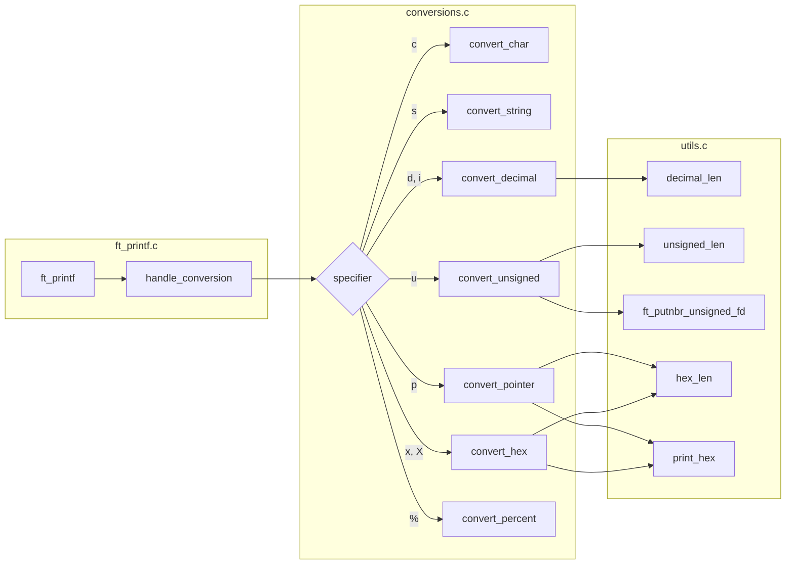

```mermaid
flowchart LR
  subgraph ft_printf.c
    A[ft_printf]
    B[handle_conversion]
  end

  subgraph conversions.c
	C{specifier}
	D[convert_char]
	E[convert_string]
	F[convert_pointer]
	G[convert_decimal]
	H[convert_unsigned]
	I[convert_hex]
	J[convert_percent]
  end

  subgraph utils.c
    L[decimal_len]
    M[unsigned_len]
    N[ft_putnbr_unsigned_fd]
    O[hex_len]
    P[print_hex]
  end

  A --> B

  B --> C

  C -->|c| D
  C -->|s| E
  C -->|p| F
  C -->|d, i| G
  C -->|u| H
  C -->|x, X| I
  C -->|%| J

  F --> O
  F --> P
  G --> L
  H --> M
  H --> N
  I --> O
  I --> P
```