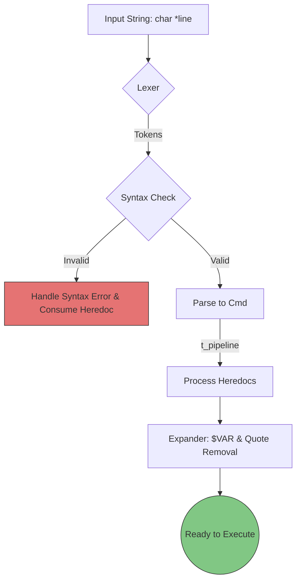
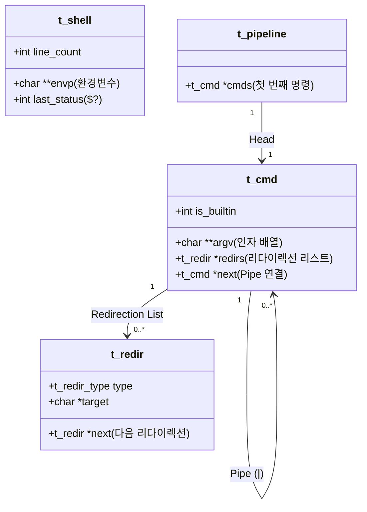

# Minishell

## 📌 프로젝트 목적

**나만의 쉘 만들기:** Bash와 유사하게 동작하는 간단한 쉘 프로그램을 처음부터 작성합니다.

**시스템 프로그래밍 심화:** 프로세스 생성/관리 및 파일 디스크립터(fd) 조작에 대한 깊이 있는 지식을 습득합니다.

**과거의 도전 체험:** Windows와 같은 GUI 이전 시대, 개발자들이 겪었던 CLI 환경 구축의 어려움과 원리를 이해합니다.

-----

## 🧠 과제 개요

Minishell은 사용자의 입력을 받아 명령어를 해석하고 실행하는 커맨드 라인 인터프리터입니다.

### 핵심 요구사항

1.  **프롬프트 및 히스토리:** 새로운 명령을 대기할 때 프롬프트를 띄우고, 작업 히스토리를 관리해야 합니다.
2.  **커맨드 실행:** PATH 변수 또는 절대/상대 경로를 통해 실행 파일을 찾아 실행합니다.
3.  **시그널 처리:** 전역 변수는 **단 하나**만 사용 가능하며, 이를 이용해 시그널 핸들러가 메인 데이터 구조에 접근하지 못하게 해야 합니다.
4.  **따옴표 처리:**
* `'` (Single Quote): 메타 문자를 해석하지 않습니다.
* `"` (Double Quote): `$`를 제외한 메타 문자를 해석하지 않습니다.
5.  **리다이렉션 & 파이프:**
* `<`, `>`, `<<` (heredoc), `>>` (append) 구현
* `|` (Pipe)를 통해 명령어 간 입출력을 연결.
6.  **확장 (Expansion):** 환경변수(`$VAR`)와 종료 상태(`$?`)를 치환해야 합니다.

-----

## 🚀 구현 계획 및 진행 상황

### 👥 역할 분담 (R\&R)

* **파싱부 (나):** Lexer, Parser, Expander (입력 문자열 → `t_pipeline` 구조체 변환)
* **실행부 (팀원):** Executor, Builtins, Signal Handler, Pipe/Redir 연결

### 📅 개발 단계 (Roadmap)

#### Phase 1: 기본 구조 잡기

- [x] `minishell.h` 공용 구조체 정의 (`t_cmd`, `t_redir`, `t_shell` 등)
- [x] Makefile 작성 및 라이브러리(Libft) 연동
- [x] 기본 루프 구현: `readline`으로 입력받고 프롬프트 띄우기

#### Phase 2: 파싱부 (Parser) 구현

- [x] **Lexer:** 입력 문자열을 토큰(Token) 리스트로 분리 (`|`, `<`, `>`, `Word` 등)
- [x] **Syntax Error:** 닫히지 않은 따옴표, 잘못된 파이프 위치 등 문법 오류 검출
- [x] **Parser:** 토큰을 `t_pipeline` -> `t_cmd` 연결 리스트로 구조화
- [x] **Expander:** `$VAR`, `$?` 환경변수 치환 및 Quote(`'`, `"` ) 제거

#### Phase 3: 실행부 (Executor) 구현

- [ ] **Builtins:** `echo`, `cd`, `pwd`, `export`, `unset`, `env`, `exit` 구현
- [ ] **Path Finder:** 외부 명령어 실행을 위한 경로 탐색 로직
- [ ] **Redirections:** `dup2`를 이용한 입출력 제어 (`<`, `>`, `>>`)
- [ ] **Pipes:** `pipe`, `fork`를 이용한 다중 프로세스 파이프라인 연결

#### Phase 4: 심화 기능 및 통합

- [ ] **Heredoc (`<<`):** 임시 파일 또는 파이프를 이용한 입력 처리 (실행부 주도)
- [ ] **Signal:** `Ctrl-C`, `Ctrl-D`, `Ctrl-\` 동작 제어 (Interactive/Blocking/Heredoc 모드 구분)
- [ ] **Memory:** `valgrind` 체크 및 누수 정리

-----

## 📊 System Architecture

### 1. Parsing Pipeline


### 2. 데이터 구조



-----

## 🛠️ 디버깅 및 문제 해결 히스토리

### Parsing Part

#### 1. Norminette 준수를 위한 전략적 함수 분리
- Issue: parse_to_cmd와 write_heredoc_to_file 같은 핵심 로직이 25줄을 초과하여 Norm 규정을 위반함.
- Solution:
	- 단순히 줄을 나누는 것이 아니라 '에러 처리 로직(Cleanup)'과 '핵심 로직'을 분리함.
	- abort_parsing과 같은 통합 에러 처리 헬퍼를 도입하여 메인 함수의 가독성을 높이고 중복 코드를 제거함.
	- expand_cmd_utils.c와 같이 성격이 다른 보조 로직들을 파일 단위로 모듈화하여 유지보수성을 확보함.

#### 2. Bash와의 완벽한 호환성: Syntax Error 시 Heredoc 처리
- Issue: cat << A | | 처럼 문법 에러가 발생했을 때, 에러 지점 이전의 히어독 입력을 받아야 하는 Bash의 특이 동작 재현.
- Solution: handle_syntax_error 단계에서 즉시 종료하지 않고, 에러 발생 지점까지만 토큰을 탐색하여 히어독 입력을 소모(Consume)하고 버리는 consume_heredoc_on_error 로직을 구현함.
- Security: 이 과정에서 fork를 활용하여 자식 프로세스에서 입력을 받게 함으로써, 메인 프로세스의 시그널 상태를 보호하고 자식 프로세스 종료 시 메모리를 일괄 해제(Cleanup)하도록 설계함.

#### 3. State Machine 기반의 견고한 Lexer 설계
- Issue: 따옴표(', ") 내부에 포함된 메타 문자(|, <, >)나 공백이 토큰으로 분리되는 문제.
- Solution:
	- quote 변수를 활용한 상태 기계(State Machine) 로직을 도입.
	- 따옴표 밖일 때만 메타 문자를 인식하고, 따옴표 안에서는 모든 문자를 일반 문자로 취급하여 단어의 경계를 정확히 파악함.
	- scan_word_end 함수를 통해 렉싱 단계에서 닫히지 않은 따옴표 에러를 사전에 차단함.

#### 4. 환경변수 확장 및 따옴표 제거의 순서 보장
- Issue: $VAR 확장 후의 공백 처리(Word Splitting)와 따옴표 제거(Quote Removal)의 시점 문제.
- Solution:
	- [환경변수 확장] -> [단어 분리] -> [따옴표 제거] 순으로 엄격히 단계를 나눔.
	- 확장 전에는 따옴표를 보존하여 단어 경계를 보호하고, 확장이 끝난 후 최종적으로 remove_quotes를 수행하여 데이터의 무결성을 보장함.

#### 5. 데이터 구조의 효율적 선택 (List vs Array)
- Issue: 명령어 인자(argv)와 리다이렉션(redirs)의 관리 방식 차이.
- Reasoning:
	- argv는 execve 시스템 콜이 요구하는 형식을 맞추기 위해 최종적으로 이중 배열로 관리함.
	- redirs는 개수가 가변적이고 타입(IN, OUT, APPEND, HEREDOC) 정보를 함께 담아야 하므로 유연한 연결 리스트(Linked List) 구조를 선택함.

### 테스트 케이스

* `ls -l | grep .c | wc -l`
* `cat << END | grep hello`
* `echo "$USER is $HOME"` vs `echo '$USER is $HOME'`

-----
## 📂 디렉토리 구조
<details>
<summary>디렉토리 구조</summary>

```text
minishell/
.
├── Dockerfile
├── Makefile
├── README.md
├── en.subject_minishell_new.pdf
├── include
│   ├── exec.h
│   ├── minishell.h
│   └── parser.h
├── libft
│   ├── Makefile
│   ├── ft_atoi.c
│   ├── ft_bzero.c
│   ├── ft_calloc.c
│   ├── ft_isalnum.c
│   ├── ft_isalpha.c
│   ├── ft_isascii.c
│   ├── ft_isdigit.c
│   ├── ft_isprint.c
│   ├── ft_itoa.c
│   ├── ft_lstadd_back_bonus.c
│   ├── ft_lstadd_front_bonus.c
│   ├── ft_lstclear_bonus.c
│   ├── ft_lstdelone_bonus.c
│   ├── ft_lstiter_bonus.c
│   ├── ft_lstlast_bonus.c
│   ├── ft_lstmap_bonus.c
│   ├── ft_lstnew_bonus.c
│   ├── ft_lstsize_bonus.c
│   ├── ft_memchr.c
│   ├── ft_memcmp.c
│   ├── ft_memcpy.c
│   ├── ft_memmove.c
│   ├── ft_memset.c
│   ├── ft_putchar_fd.c
│   ├── ft_putendl_fd.c
│   ├── ft_putnbr_fd.c
│   ├── ft_putstr_fd.c
│   ├── ft_split.c
│   ├── ft_strchr.c
│   ├── ft_strdup.c
│   ├── ft_striteri.c
│   ├── ft_strjoin.c
│   ├── ft_strlcat.c
│   ├── ft_strlcpy.c
│   ├── ft_strlen.c
│   ├── ft_strmapi.c
│   ├── ft_strncmp.c
│   ├── ft_strnstr.c
│   ├── ft_strrchr.c
│   ├── ft_strtrim.c
│   ├── ft_substr.c
│   ├── ft_tolower.c
│   ├── ft_toupper.c
│   ├── ftp
│   │   ├── Makefile
│   │   ├── ft_conversions.c
│   │   ├── ft_convert_char.c
│   │   ├── ft_convert_decimal.c
│   │   ├── ft_convert_hex.c
│   │   ├── ft_convert_percent.c
│   │   ├── ft_convert_pointer.c
│   │   ├── ft_convert_string.c
│   │   ├── ft_convert_unsigned.c
│   │   ├── ft_printf.c
│   │   ├── ft_printf.h
│   │   ├── ft_utils.c
│   │   └── libft
│   │       ├── ftp_putchar_fd.c
│   │       ├── ftp_putnbr_fd.c
│   │       ├── ftp_putstr_fd.c
│   │       ├── ftp_strlen.c
│   │       └── libft.h
│   ├── gnl
│   │   ├── get_next_line.c
│   │   ├── get_next_line.h
│   │   └── get_next_line_utils.c
│   ├── include
│   │   ├── ft_printf.h
│   │   ├── get_next_line.h
│   │   └── libft.h
│   └── libft2.h
├── minishell.supp
└── src
    ├── exec
    │   ├── exe_builtin.c
    │   ├── exe_external.c
    │   ├── exe_pipeline.c
    │   ├── exe_redir.c
    │   ├── exe_single_cmd.c
    │   ├── exe_utils1.c
    │   ├── exe_utils2.c
    │   ├── ft_builtin
    │   │   ├── env_utils
    │   │   │   ├── env_copy.c
    │   │   │   ├── env_set_unset.c
    │   │   │   ├── env_utils.c
    │   │   │   └── env_valid.c
    │   │   ├── ft_cd.c
    │   │   ├── ft_echo.c
    │   │   ├── ft_env.c
    │   │   ├── ft_exit.c
    │   │   ├── ft_export.c
    │   │   ├── ft_export_print.c
    │   │   ├── ft_pwd.c
    │   │   └── ft_unset.c
    │   └── is_builtin.c
    ├── free_utils.c
    ├── main.c
    ├── parser
    │   ├── check_syntax.c
    │   ├── env_utils.c
    │   ├── expand.c
    │   ├── expand_cmd.c
    │   ├── expand_cmd_utils.c
    │   ├── expand_utils.c
    │   ├── heredoc.c
    │   ├── heredoc_on_error.c
    │   ├── heredoc_utils.c
    │   ├── lexer.c
    │   ├── lexer_utils.c
    │   ├── parser.c
    │   ├── parser_cmd.c
    │   ├── parser_cmd_utils.c
    │   ├── quote_removal.c
    │   └── token_list_utils.c
    └── signals.c

```
</details>

-----

*This project has been created as part of the 42 curriculum by sisung and hama.*

# Description
Minishell is a project that involves creating a simple shell, essentially a "little Bash". The primary goal is to gain extensive knowledge about processes and file descriptors by implementing core shell functionalities. This shell can execute commands, manage environment variables, and handle pipes and redirections.

# Instructions
## Compilation
To compile the project, run the following command in the root directory:
```bash
make

```

This will generate the `minishell` executable using the flags `-Wall -Wextra -Werror`. The Makefile includes the required rules: `all`, `clean`, `fclean`, `re`, and `$(NAME)`.

## Execution

Launch the shell by running:

```bash
./minishell

```

# Features

* **Prompt**: Displays a prompt when waiting for a new command.
* **History**: Working command history (excluding heredoc delimiters).
* **Executables**: Search and launch binaries based on the `PATH` variable or relative/absolute paths.
* **Built-ins**: Implements `echo`, `cd`, `pwd`, `export`, `unset`, `env`, and `exit`.
* **Redirections**: Supports `<`, `>`, `<<`, and `>>`.
* **Pipes**: Connects command outputs to inputs via pipes.
* **Environment Variables**: Expands `$VAR` and `$?` (exit status).
* **Signals**: Handles `ctrl-C`, `ctrl-D`, and `ctrl-\` similarly to Bash.

# Resources

## References

* [Bash Reference Manual](https://www.gnu.org/software/bash/manual/)
* [GNU Readline Library Documentation](https://tiswww.case.edu/php/chet/readline/rltop.html)

## AI Usage

As required by the subject, the use of AI tools in this project is described below:

* **Task 1: Parsing Logic**: Used AI to help design the overall parser architecture, which was then reviewed and refined with peers to ensure understanding.

* **Task 2: Error Handling**: Consulted AI to interpret specific Valgrind 'still reachable' memory logs and design the `cleanup_and_exit` logic for child processes.

* **Task 3: Technical Explanations**: Used AI to clarify the behavior of signals in interactive mode and how they interact with file descriptors.

* All AI-generated suggestions were systematically tested and reviewed to ensure compliance with the project's requirements.

# Technical Choices

## 1. Parsing & Pipeline Architecture
The shell employs a modular parsing strategy divided into Lexer, Tokenizer, and Parser stages to ensure strict compliance with Bash behavior.
- **Tokenization**: The input line is split into tokens while respecting single and double quotes.
- **Pipeline Structure**: Commands separated by pipes are organized into a `t_pipeline` linked list. Each node (`t_cmd`) contains its own `argv` array and a redirection list (`t_redir`).
- **Expansion**: Environment variables ($VAR) and the exit status ($?) are expanded during the parsing phase before execution.

## 2. Robust Memory Management
Adhering to the "zero-leak" policy (excluding `readline`), the project implements a rigorous cleanup strategy.
- **Centralized Freeing**: A `free_pipeline` function systematically deallocates the entire AST-like structure after each execution cycle.
- **Child Process Cleanup**: To eliminate "still reachable" memory in Valgrind, child processes explicitly call a cleanup function to free duplicated heap memory (such as `envp` and command structures) before calling `exit()` or `execve()` failure.

## 3. Signal Handling Strategy
Following the subject's constraints, signal management is designed to be minimal and safe.
- **Global Variable**: A single global integer is used solely to store the signal number, preventing unsafe access to main data structures within the signal handler.
- **Interactive Mode**: Specific handlers for `ctrl-C` and `ctrl-\` ensure the shell remains interactive and responsive, mimicking Bash's behavior.

## 4. Built-in Implementation
Built-in commands are integrated directly into the shell's process to manage the environment and shell state effectively.
- **Environment Management**: `export` and `unset` modify a duplicated environment list, ensuring changes persist throughout the session.
- **Path Lookup**: Commands are resolved by scanning the `PATH` variable or via absolute/relative paths, with careful handling of edge cases where `PATH` is unset.

## 5. Execution Architecture (Execution Part)

The execution layer is responsible for transforming the parsed command structures into
actual running processes. This part focuses on correct process control, file descriptor
management, and faithful reproduction of Bash-like behavior.

The execution logic is divided into **single command execution** and **pipeline execution**.

---

### 5.1 Single Command Execution

When a single command is detected (no pipe):

1. The command is first checked for emptiness.
2. Built-in commands that must affect the shell state (`cd`, `export`, `unset`, `exit`)
   are executed **directly in the parent process**.
3. All other commands are executed in a **child process** created via `fork()`.

For parent-builtins with redirections:
- The original `stdin` and `stdout` are saved using `dup()`
- Redirections are applied
- The built-in is executed
- File descriptors are restored afterward

This ensures that redirections do not permanently affect the shell’s input/output.

---

### 5.2 Pipeline Execution

When multiple commands are connected by pipes:

- Each command runs in its own child process
- Pipes are created dynamically using `pipe()`
- `dup2()` is used to connect:
  - the previous command’s output to the next command’s input
- All unnecessary file descriptors are closed immediately to prevent leaks

Built-in commands inside pipelines are executed **in child processes**, matching Bash behavior.
State-changing built-ins inside pipelines do not affect the parent shell.

The exit status of the **last command in the pipeline** is stored as the shell’s last status.

---

### 5.3 External Command Execution

External commands are executed using `execve()`.

Execution rules:
- If the command contains `/`, it is treated as an absolute or relative path
- Otherwise, the `PATH` environment variable is searched
- If `PATH` is unset or the command is not found:
  - `command not found` is printed
  - exit status `127` is returned
- Permission errors return exit status `126`

Path resolution is implemented manually to strictly follow project constraints.

---

### 5.4 Environment Handling During Execution

- Minishell maintains its own duplicated `envp`
- Built-in commands (`export`, `unset`) modify this internal environment
- External commands receive the updated environment via `execve()`
- Changes persist only during the shell session, as required

---

### 5.5 Signal Handling During Execution

Signal behavior differs between parent and child processes:

- **Parent process**
  - Ignores `SIGINT` and `SIGQUIT` during execution
  - Remains interactive

- **Child processes**
  - Restore default signal behavior
  - Allow signals to terminate commands as in Bash

This separation ensures correct interactive behavior without unexpected shell termination.

---

### 5.6 Exit Handling

The `exit` built-in is executed only in the parent process.

Behavior:
- `exit` without arguments exits with the last command’s status
- Numeric arguments are parsed and reduced to an unsigned char
- Invalid arguments produce an error message and exit status `2`
- When executed, a `should_exit` flag is set to safely terminate the main loop

This avoids abrupt exits and ensures proper memory cleanup.

---

## 6. Summary of Execution Responsibilities

The execution part ensures:

- Correct parent vs child execution logic
- Safe and reversible redirections
- Accurate pipeline behavior
- Persistent environment handling
- Bash-compatible exit statuses and signals

All execution paths were tested extensively using manual tests and Valgrind to ensure
stability and correctness under edge cases.
