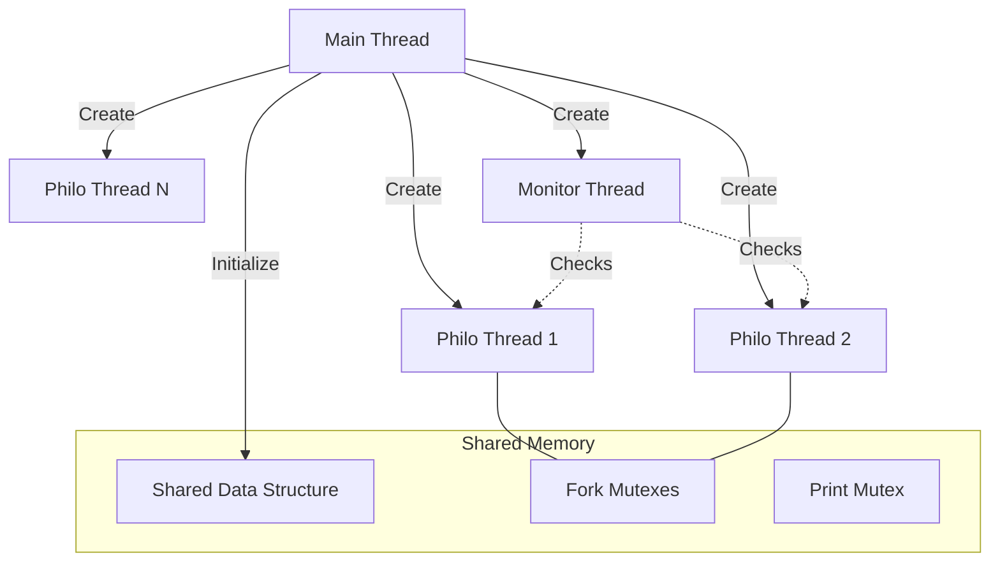
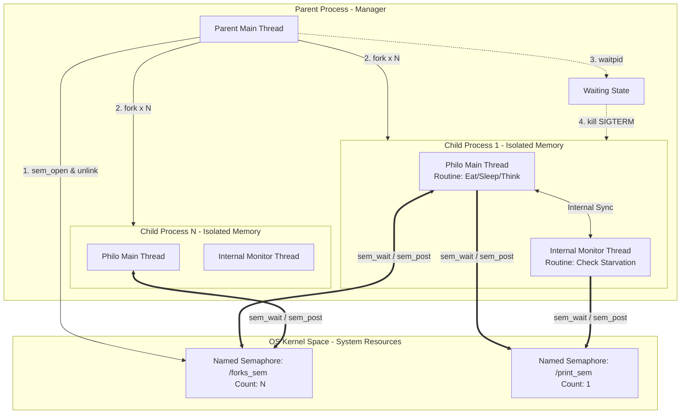

# philosopher

## 📌 프로젝트 목적

이 프로젝트의 주 목적은 **멀티태스킹 프로그래밍**의 기본 원리, 특히 **스레드(Threads)**와 **뮤텍스(Mutexes)** (필수 파트) 또는 **프로세스(Processes)**와 **세마포어(Semaphores)** (보너스 파트)를 이해하고 적용하는 것입니다.
이를 통해 **공유 자원**에 대한 접근을 안전하게 관리하고, **데드락(Deadlock)** 및 **경쟁 상태(Race Condition)**와 같은 **동시성 문제**를 해결하는 방법을 학습하는 데 있습니다.

---

## 🧠 과제 개요

### 🍽️ 식사하는 철학자 문제 (Dining Philosophers Problem)

원탁에 앉은 **철학자들**과 그들 사이에 놓인 **포크**를 사용하여 식사, 수면, 생각을 반복하는 시뮬레이션을 구현합니다.
철학자는 식사를 위해 **오른쪽**과 **왼쪽**의 포크 두 개를 모두 확보해야 합니다.
시뮬레이션의 목표는 철학자가 **굶어 죽지 않도록** (`time_to_die` 시간 내에 식사를 시작하지 못하면 사망) **공정한 식사 분배**를 보장하는 것입니다.

### 💻 필수 및 보너스 파트

#### 🔹 필수 파트 (`philo`)
- **동시성 제어 메커니즘**: 뮤텍스 (`pthread_mutex_*`)
- **철학자 표현**: 스레드
- **포크 관리**: 각 포크는 뮤텍스로 보호

#### 🔹 보너스 파트 (`philo_bonus`)
- **동시성 제어 메커니즘**: 세마포어 (`sem_*`)
- **철학자 표현**: 프로세스 (`fork`, `kill`)
- **포크 관리**: 사용 가능한 포크 수를 세마포어로 중앙 관리


> ⚠️ **주의사항**: 보너스 파트는 **필수 파트가 완벽하게** 작동하는 경우에만 평가됩니다.

### ⚙️ 프로그램 인자 (Global rules)

프로그램은 다음 인자들을 받습니다:

1. `number_of_philosophers`: 철학자 수이자 포크 수.
2. `time_to_die` (ms): 마지막 식사 시작 또는 시뮬레이션 시작 후 이 시간 내에 식사하지 않으면 철학자 사망.
3. `time_to_eat` (ms): 철학자가 식사하는 데 걸리는 시간.
4. `time_to_sleep` (ms): 철학자가 잠자는 데 걸리는 시간.
5. `[number_of_times_each_philosopher_must_eat]` (선택): 모든 철학자가 이 횟수 이상 식사하면 시뮬레이션 종료. 생략 시 철학자가 사망할 때까지 진행.

---

## 🚀 구현 계획 및 진행 상황

### 1단계: 환경 설정 및 구조체 정의
- [x] `t_philo` 구조체 정의 (철학자 정보)
- [x] `t_data` 구조체 정의 (전체 시뮬레이션 정보 및 공유 자원)
- [x] 철학자 수만큼 포크/뮤텍스 배열 할당
- [x] 입력 인자 파싱 및 유효성 검사

### 2단계: 필수 파트 (`philo` - 스레드 & 뮤텍스)
- [x] 각 철학자를 스레드로 생성
- [x] 포크를 뮤텍스로 보호하고, 두 포크 획득 시 식사 시작
- [x] 데드락 방지 로직 구현 (홀수/짝수 철학자 포크 집는 순서 차등 등)
- [x] `gettimeofday`를 사용하여 밀리초 단위 시간 관리 및 로그 출력
- [x] 철학자 사망 또는 최소 식사 횟수 충족 시 종료
- [x] 공유 변수 접근 시 뮤텍스로 데이터 경쟁 방지

### 3단계: 보너스 파트 (`philo_bonus` - 프로세스 & 세마포어)
- [x] 철학자를 프로세스로 생성 (`fork`)
- [x] 포크를 세마포어(`sem_open`, `sem_wait`, `sem_post`)로 중앙 관리
- [x] 로그 출력을 위한 세마포어 동기화 적용
- [x] 메인 프로세스가 철학자 종료 감지 후 다른 프로세스 종료 (`kill`, `waitpid`)

### 4단계: 종료 및 리소스 정리
- [x] 모든 뮤텍스/세마포어 해제
- [x] 모든 스레드/프로세스 정상 종료 확인
- [x] 메모리 누수 검사 (`valgrind` 등 사용)

---
## 🏗️ 아키텍처

### Mandatory Part

#### 아키텍처 구조도 (Flowchart)



#### 철학자 루틴 (Sequence Diagram)



```mermaid
sequenceDiagram
    participant P as Philosopher
    participant F as Forks (Mutex)
    participant M as Monitor

    rect rgb(50, 50, 50)
    Note over P: Thinking
    P->>F: Lock Left Fork
    P->>F: Lock Right Fork
    Note over P: Eating (Update last_meal_time)
    M-->>P: Check Life Status
    P->>F: Unlock Both Forks
    Note over P: Sleeping
    end
```

### Bonus Part

#### 아키텍처 구조도 (Flowchart)



#### 철학자 루틴 (Sequence Diagram)




```mermaid
sequenceDiagram
	box rgb(30, 40, 60) Child Process Memory Space
    participant P as Philo Main Thread
    participant M as Internal Monitor Thread
    end
	box rgb(60, 30, 30) Kernel Space [Semaphores]
    participant SF as /forks_sem (Count N)
    participant SP as /print_sem (Count 1)
    end

    Note over P, M: Process Created via fork()

    par Parallel Execution
        P->>P: Start Routine Loop
    and
        M->>M: Start Monitoring Loop
    end

    loop Simulation Routine (Main Thread)
        Note over P: Thinking

        P->>+SF: sem_wait() (Try take fork 1)
        SF-->>-P: Acquired
        P->>+SF: sem_wait() (Try take fork 2)
        SF-->>-P: Acquired

        rect rgb(30, 50, 30)
            Note over P: Eating Status
            P->>+SP: sem_wait() (Lock Print)
            P->>P: Update last_meal_time (Atomic with internal lock)
            P-->>SP: print("is eating")
            SP-->>-P: sem_post() (Unlock Print)
            P->>P: usleep(time_to_eat)
        end

        P->>SF: sem_post() (Release fork 1)
        P->>SF: sem_post() (Release fork 2)

        Note over P: Sleeping
        P->>P: usleep(time_to_sleep)
    end

    par Death Detection Scenario
        loop Monitoring (Monitor Thread)
            M->>M: Check (current_time - last_meal_time) > time_to_die
        end
        Note right of M: Starvation Detected!
        M->>+SP: sem_wait() (Lock Print)
        M-->>SP: print("died")
        Note over M: exit(1) called causing Process Termination
    and Main Thread Interrupted
        P->>P: Process Terminated abruptly by sibling thread's exit()
    end
```

## 🛠️ 디버깅 및 문제 해결 히스토리

### Mandatory Part

#### 1. [Memory] size_t 언더플로우로 인한 메모리 오염
- Issue: 초기화 실패 시 실행되는 clean_philos_on_fail 함수에서 세그멘테이션 폴트(Segfault) 발생.
- Cause: 역순 루프 while (--i >= 0)에서 i가 부호 없는 정수(size_t) 타입이라 0 아래로 내려가는 순간 최대값으로 점프(Underflow)하여 잘못된 메모리에 접근함.
- Solution: while (i > 0) 조건을 사용하고 루프 내부에서 i--를 수행하도록 변경하여 안전한 하향 카운트 보장.
- Insight: 시스템 프로그래밍에서 자료형의 선택(signed vs unsigned)이 루프 조건과 메모리 안전성에 미치는 치명적인 영향을 학습함.

#### 2. [Concurrency] 예외 처리 로직이 유발한 "철학자의 불면증"
- Issue: 시간 측정 실패 시 즉시 리턴하도록 설계하자, 철학자들이 정해진 시간만큼 자지 않고 즉시 깨어나는 현상 발생.
- Cause: void 함수인 ft_usleep에서 에러 발생 시 return하면 대기 루프를 건너뛰게 되어 식사 후 대기 시간이 0ms가 됨.
- Solution: 시스템 콜 실패라는 극희박한 확률보다 시뮬레이션의 흐름 유지를 우선순위로 설정. 에러 시 즉시 종료가 아닌, 시스템 usleep을 호출하는 폴백(Fallback) 로직 적용.

#### 3. [Synchronization] last_eat_time 데이터 레이스 해결
- Issue: 모니터 스레드가 사망을 판단하는 기준인 last_eat_time 읽기/쓰기 시 오차 및 부정확한 사망 판정 발생.
- Cause: 식사 종료 시점에 업데이트 시 time_to_eat만큼 생존 보너스를 얻는 논리 오류.
공유 자원에 대한 뮤텍스 보호 부재로 인한 데이터 레이스(Data Race).
- Solution: 업데이트 기준을 식사 시작 시점으로 고정하고, 전용 뮤텍스(meal_mutex)를 추가하여 원자적(Atomic) 연산 보장.

#### 4. [Performance] 시스템 콜 오버헤드 최적화
- Issue: 철학자 수가 늘어날수록 로그 출력 속도가 실제 시간보다 밀리는 현상(Log Lag).
- Cause: print_log 내부에서 예외 처리와 출력을 위해 gettimeofday를 중복 호출함. 시스템 콜은 컨텍스트 스위칭 비용이 커서 빈번한 호출 시 성능 저하 유발.
- Solution: 현재 시간을 지역 변수(now)에 저장하여 재사용하는 방식으로 리팩토링하여 시스템 자원 소모 최소화.

#### 5. [Fairness] 자원 점유 불균형 및 스케줄링 최적화
- Issue: 철학자가 홀수 명(5명)일 때, 낮은 ID(1, 2번) 철학자가 자원을 독점하고 높은 번호의 철학자가 기아(Starvation) 상태에 빠짐.
- Cause: 원형 구조에서 마지막 철학자와 1번 철학자가 모두 홀수일 때 패턴 충돌 발생. 운영체제 스케줄러가 특정 스레드를 선점하게 됨.
- Solution: 인원수(Odd/Even)와 본인의 ID에 따라 시차를 두는 컨텍스트 인식 딜레이(Context-aware Staggered Start) 로직 적용.

```C
// 인원수의 홀/짝 특성에 따라 시작 타이밍을 분산하여 공정성 확보
if (data->num_of_philos % 2 != 0 && (philo->id) % 2 != 0)
    usleep_ms(5);
else if (data->num_of_philos % 2 == 0 && (philo->id) % 2 == 0)
    usleep_ms(5);
```

- Result: 특정 ID에 쏠리던 식사 패턴이 전체 철학자에게 균등하게 분산됨을 확인. 시스템의 공정성(Fairness)과 안정성 동시 확보.

### Bonus part

#### 1. [Tooling] 새니타이저(ASan/TSan) 상호 배타성 및 런타임 충돌
- Issue: CFLAGS에 AddressSanitizer(ASan)와 ThreadSanitizer(TSan)를 동시에 적용 시 컴파일 에러 또는 실행 오류 발생.
- Cause: 두 도구 모두 쉐도우 메모리(Shadow Memory)를 할당하고 표준 라이브러리 함수를 가로채기(Interception) 때문에 메모리 레이아웃 충돌이 발생함. 또한 ASan과 Valgrind를 동시에 실행할 경우 메모리 관리 주도권 다툼으로 인해 SIGSEGV 발생.
- Solution: 메모리 누수 및 오염은 ASan으로, 데이터 레이스는 TSan으로 각각 독립적인 디버깅 세션을 분리하여 테스트 진행. 도구 간의 특성을 이해하고 상호 배타적 사용 원칙 준수.

#### 2. [Environment] 리눅스 ASLR과 TSan의 메모리 매핑 충돌
- Issue: TSan 적용 시 FATAL: ThreadSanitizer: unexpected memory mapping 에러와 함께 프로그램 즉시 종료.
- Cause: 리눅스 보안 기능인 ASLR(Address Space Layout Randomization)이 메모리 주소를 무작위로 배치하는데, TSan이 기대하는 고정된 메모리 맵과 충돌하여 발생 (특히 WSL2 환경에서 빈번함).
- Solution: sudo sysctl kernel.randomize_va_space=0 명령을 통해 일시적으로 ASLR을 비활성화하여 TSan이 정상적으로 메모리 흐름을 추적할 수 있는 환경 구축.

#### 3. [Concurrency] 자식 프로세스 종료 시 Use-After-Free 발생
- Issue: 자식 프로세스가 사망을 감지하고 종료되는 과정에서 ASan이 heap-use-after-free 에러 감지.
- Cause: 메인 흐름이 finalize_data를 통해 메모리를 해제하는 순간, 병렬로 동작하던 모니터 스레드가 해당 메모리 주소(예: last_meal_time)를 읽으려고 시도하여 발생.
- Solution: "우아한 종료(Graceful Exit)"를 위해 pthread_join을 시도하는 대신, 사망 메시지 출력 즉시 exit(1)을 호출하도록 변경. 자식 프로세스의 모든 자원은 커널이 회수하도록 맡김으로써 데이터 레이스와 해제 후 접근 문제를 근본적으로 차단.

#### 4. [IPC] 세마포어 조작으로 인한 "유령 포크(Ghost Fork)" 현상
- Issue: 자식 프로세스를 깨우기 위해 세마포어를 조작할 때 시뮬레이션의 논리적 무결성이 깨짐.
- Cause: sem_wait에 갇힌 메인 흐름을 깨우기 위해 모니터 스레드가 sem_post를 호출할 경우, 해당 자원이 시스템 전체 공용(System-wide)이기 때문에 다른 프로세스의 철학자가 존재하지 않는 가짜 포크를 집어가는 현상 발생.
- Solution: 세마포어를 통한 강제 깨우기 로직을 지양하고, 부모 프로세스가 waitpid로 사망 소식을 듣는 즉시 모든 자식에게 kill 시그널을 보내 시뮬레이션을 중단시키는 설계 채택.

#### 5. [Architecture] 10ms 사망 규칙과 시스템 오버헤드 간의 트레이드오프
- Issue: Valgrind나 새니타이저 실행 시 프로그램이 느려져 사망 판정 규정(10ms)을 지키지 못하는 문제.
- Cause: 디버깅 도구의 에뮬레이션 오버헤드로 인해 실제 시간 흐름과 프로그램 내부 시간 측정 간의 간극 발생.
- Solution: 성능 분석 시에는 디버깅 플래그를 제거한 순수 빌드본을 사용하고, 메모리 안정성 검사는 별도의 세션에서 진행하여 "성능 최적화"와 "안정성 검증"이라는 두 마리 토끼를 잡음.

---

## 📂 디렉토리 구조

```

.
├── philo/
│   ├── src/
│   │   ├── main.c
│   │   ├── philo.c
│   │   ├── init.c
│   │   └── utils.c
│   ├── inc/
│   │   └── philo.h
│   └── Makefile
├── philo_bonus/ (선택 사항)
│   ├── src/
│   │   ├── main_bonus.c
│   │   ├── philo_bonus.c
│   │   └── ...
│   ├── inc/
│   │   └── philo_bonus.h
│   └── Makefile
└── README.md

````

---

## 빌드 및 실행

### 🏗️ 빌드 방법 (필수 파트: `philo`)
```bash
cd philo
make
````

### 🔨 빌드 방법 (보너스 파트: `philo_bonus`)

```bash
cd philo_bonus
make bonus
```

### 🚀 실행 예시

```bash
./philo number_of_philosophers time_to_die time_to_eat time_to_sleep [number_of_times_each_philosopher_must_eat]
```

예시:

```bash
./philo 5 100 50 50
./philo 4 410 200 200 5
```

---

## ✅ 최종 제출 점검표

### 필수
- [ ] C 언어로 작성됨
- [ ] Norm 준수 (Norminette 통과)
- [ ] Makefile 규칙 포함 (`all`, `clean`, `fclean`, `re`)
- [ ] 전역 변수 사용 금지
- [ ] 메모리 누수 없음
- [ ] Data Race 없음
- [ ] 데드락 없음
- [ ] 모든 인자 처리 및 유효성 검사
- [ ] 로그 형식 준수
- [ ] 사망 메시지 10ms 이내 출력
- [ ] 프로세스/스레드 개수 정확
- [ ] 외부 함수 제한 준수

### 보너스
- [ ] C 언어로 작성됨
- [ ] Norm 준수 (Norminette 통과)
- [ ] Makefile 규칙 포함 (`all`, `clean`, `fclean`, `re`)
- [ ] 전역 변수 사용 금지
- [ ] 메모리 누수 없음
- [ ] Data Race 없음
- [ ] 데드락 없음
- [ ] 모든 인자 처리 및 유효성 검사
- [ ] 로그 형식 준수
- [ ] 사망 메시지 10ms 이내 출력
- [ ] 프로세스/스레드 개수 정확
- [ ] 외부 함수 제한 준수

---

## 📝 메모

* **시간 단위**: 모든 인자는 밀리초(ms) 단위.
* **로그 동기화**: 출력은 반드시 동기화(뮤텍스/세마포어).
* **철학자 1명 케이스**: 포크를 집을 수 없어 사망해야 함.
* **자원 해제**: `pthread_mutex_destroy`, `sem_close`, `sem_unlink` 등을 반드시 호출.
